# Ad-Hoc Analysis in The Consumer Goods Industry
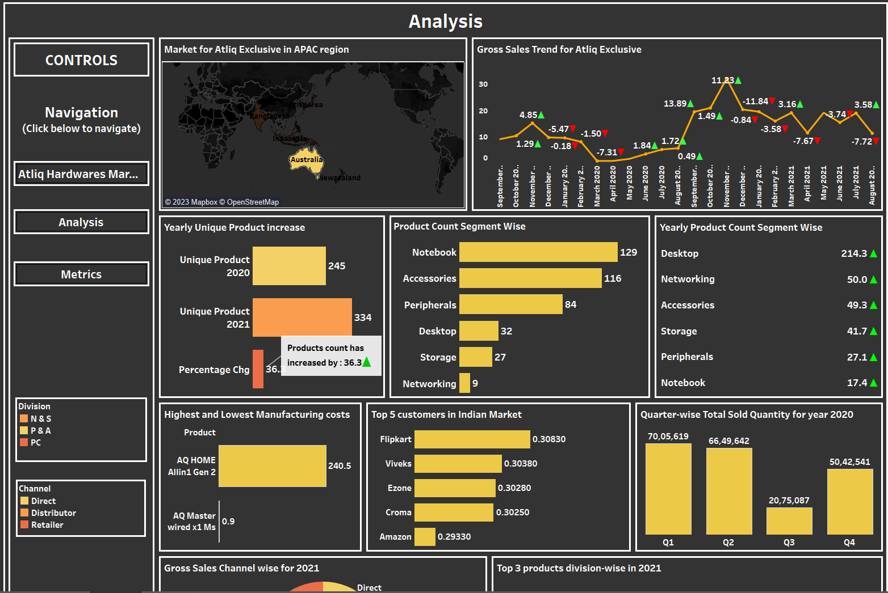

## Overview:
Atliq Hardwares (Imaginary Company) is a leading computer hardware producer in India and is expanding globally. 
However, the management noticed that they do not get enough insights to make quick and smart data-informed decisions. The management recognizes the importance of data analytics in driving informed business decisions and has decided to strengthen their data analytics team by hiring several junior data analysts. To achieve this goal, the company's data analytics director has decided to conduct a SQL challenge to evaluate the technical and soft skills of potential candidates. The challenge will assess their SQL proficiency, ability to work within strict deadline, communication skills, and collaboration skills. The results of the challenge will be used to make informed hiring decisions and build a strong and effective data analytics team that will support Atliq Hardwares in making data-driven decisions and expanding its reach in the global market.

## Requirements:
Let’s be more precise about the requirements for this project through the following points:

•Atliq Hardwares is seeking insights on 10 ad hoc requests for their business purpose.

•A SQL query-based solution is required to answer the requests.

•Creativity in presenting insights.

•Ability to effectively communicate technical information to the top-level management.


## Tools:
• **SQL**: To extract and manipulate data from the database to answer the 10 ad-hoc requests for insights.

• **Tableau**: As a visualization tool to present my findings.(you can use other tools too e.g Excel)


##  About the database schema:
1. dim_customer: contains customer-related data
```
SELECT * FROM gdb041.dim_customer;
```
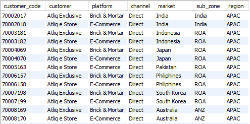

2. dim_product: contains product-related data
```
SELECT * FROM gdb041.dim_product;
```
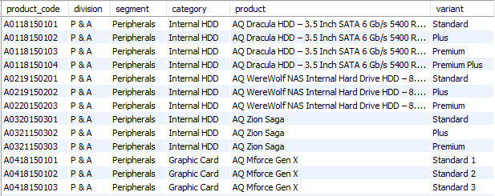

3. fact_gross_price: contains gross price information for each product
```
SELECT * FROM gdb041.fact_gross_price;
```
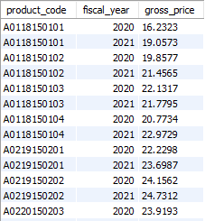

4. fact_manufacturing_cost: contains the cost incurred in the production of each product
```
SELECT * FROM gdb041.fact_manufacturing_cost;
```
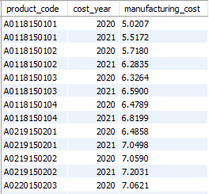

5. fact_pre_invoice_deductions: contains pre-invoice deductions information for each product
```
SELECT * FROM gdb041.fact_pre_invoice_deductions;
```
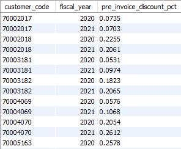

6. fact_sales_monthly: contains monthly sales data for each product.
```
SELECT * FROM gdb041.fact_sales_monthly;
```
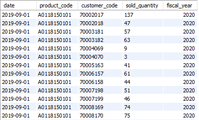

## Ad-Hoc requests:
Now it’s time to check all the requests that we need to solve one by one.
## Question 1.

**Provide the list of markets in which customer "Atliq Exclusive" operates its business in the APAC region.**

```
select distinct(market) as Market
from dim_customer
where customer = 'Atliq Exclusive' and region = 'APAC';
```
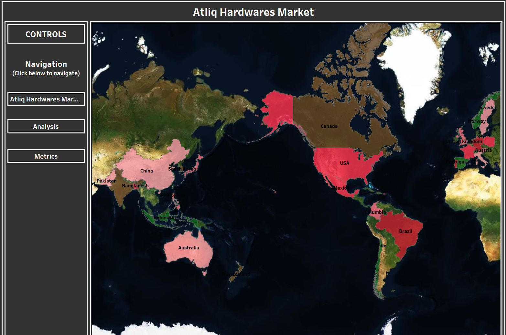


## Question 2.

**What is the percentage of unique product increase in 2021 vs. 2020? The final output contains these fields:
 a) unique_products_2020
 b) unique_products_2021
 c) percentage_chg**

```
with unique_product as (
select(select count(distinct product_code) 
		from fact_sales_monthly
		where fiscal_year = 2020) as 'unique_product_2020',
	   (select count(distinct product_code) 
		from fact_sales_monthly
		where fiscal_year = 2021) as 'unique_product_2021'
	   )
       
select unique_product_2020,
	unique_product_2021,
    round((unique_product_2021 - unique_product_2020)*100/unique_product_2020,1) percentage_chg
from unique_product;
``` 
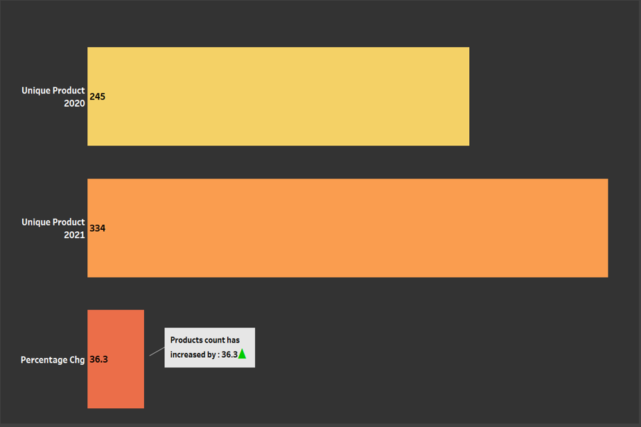

## Question 3.
**Provide a report with all the unique product counts for each segment and sort them in descending order of product counts.
The final output contains 2 fields:
a) segment 
b) product_count**

```
select segment, count(distinct product_code) as product_count
from dim_product 
group by segment
order by count(distinct product_code) desc;
```
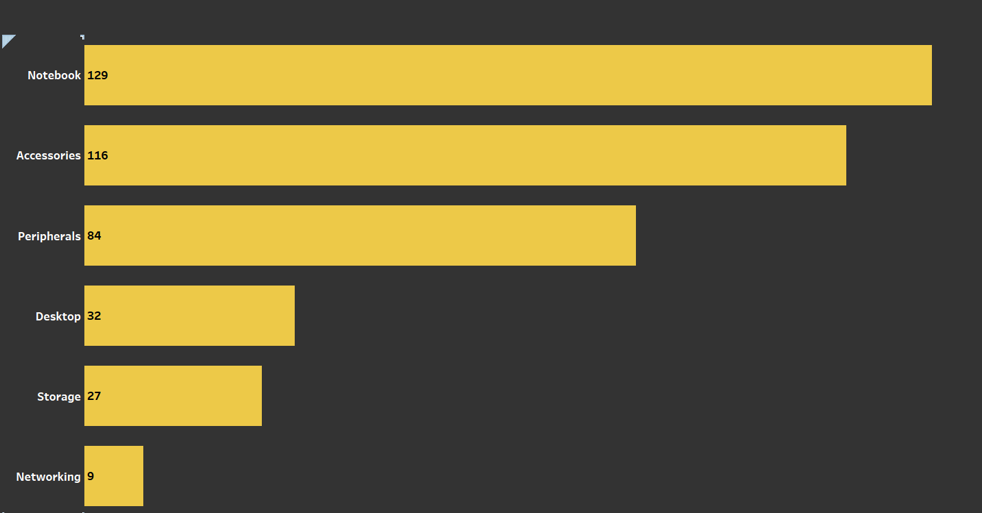

## Question 4.

**Which segment had the most increase in unique products in 2021 vs 2020? The final output contains these fields: 
a) segment 
b) product_count_2020 
c) product_count_2021 
d) difference**

```
with count2020 as(
select p.segment, count(distinct q.product_code) as product_count_2020
	   from fact_sales_monthly q
       inner join dim_product p 
       where q.fiscal_year = 2020
       and q.product_code = p.product_code
       group by p.segment),
count2021 as(
select p.segment, count(distinct q.product_code) as product_count_2021
	   from fact_sales_monthly q
       inner join dim_product p 
       where q.fiscal_year = 2021
       and q.product_code = p.product_code
       group by p.segment)

select c20.segment,
       c20.product_count_2020,
       c21.product_count_2021,
       (c21.product_count_2021 - c20.product_count_2020) as difference,
       round((c21.product_count_2021 - c20.product_count_2020)*100/c20.product_count_2020,2) as pct_difference
from count2020 c20 
inner join count2021 c21
where c20.segment = c21.segment
order by pct_difference desc;
```
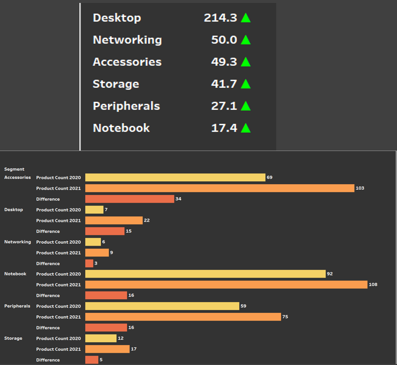

## Question 5.

**Get the products that have the highest and lowest manufacturing costs. The final output should contain these fields:
a) product_code 
b) product 
c) manufacturing_cost**
```
(select m.product_code,
       p.product,
       m.manufacturing_cost as manufaturing_cost
from fact_manufacturing_cost m
inner join dim_product p  
where m.product_code = p.product_code
order by manufacturing_cost desc
limit 1)
union
(select m.product_code,
       p.product,
       m.manufacturing_cost
from fact_manufacturing_cost m
inner join dim_product p  
where m.product_code = p.product_code
order by manufacturing_cost
limit 1
);
```
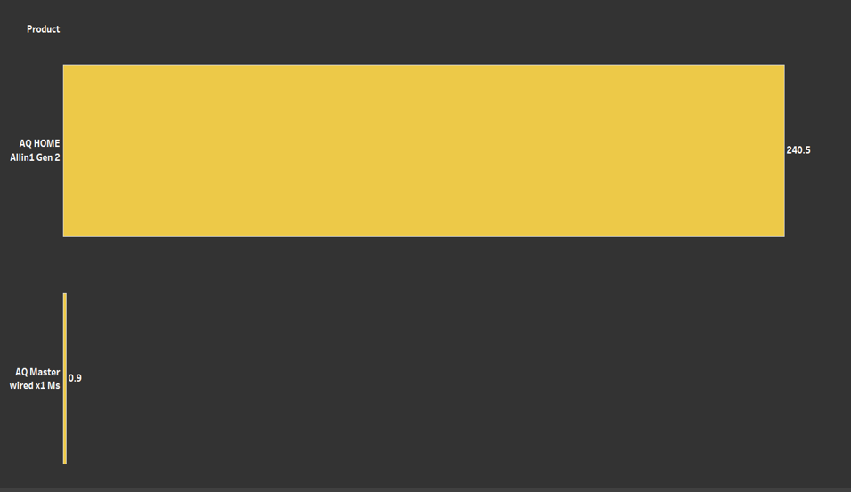

## Question 6.

**Generate a report which contains the top 5 customers who received an average high pre_invoice_discount_pct  for the fiscal year 2021 and in the Indian market. The final output contains these fields:
a) customer_code 
b) customer 
c) average_discount_percentage**
```
select i.customer_code,
       c.customer,
       i.pre_invoice_discount_pct
from fact_pre_invoice_deductions i 
inner join dim_customer c 
where i.customer_code = c.customer_code
and c.market = 'India'
and i.fiscal_year = 2021
order by i.pre_invoice_discount_pct desc
limit 5;
```
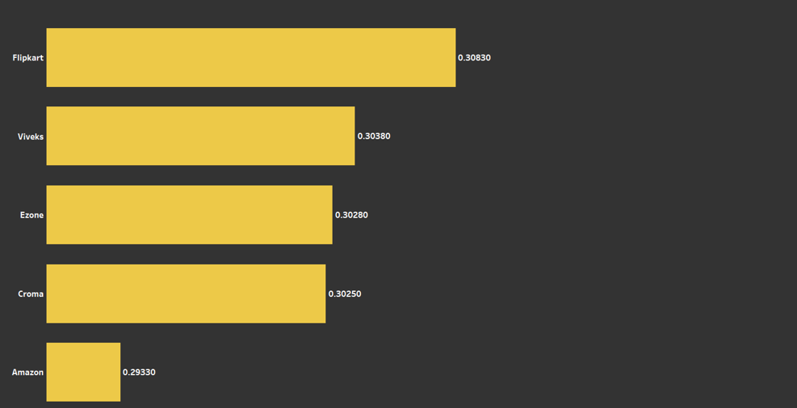


## Question 7.

**Get the complete report of the Gross sales amount for the customer “Atliq Exclusive” for each month. This analysis helps to get an idea of low and high-performing months and take strategic decisions. The final report contains these columns: 
a) Month 
b) Year 
c) Gross sales Amount**
```
select month(s.date) as month,
       year(s.date) as year,
       round(sum(p.gross_price*s.sold_quantity)/1000000,2) as gross_sales_amount
from fact_gross_price p
inner join fact_sales_monthly s
inner join dim_customer c
where p.product_code = s.product_code 
and s.customer_code = c.customer_code
and c.customer = 'Atliq Exclusive'
group by year(s.date), month(s.date) 
order by year(s.date), month(s.date);
```

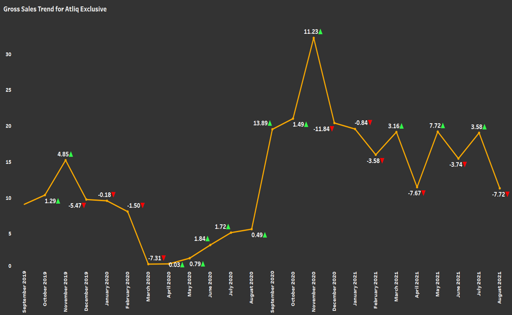

## Question 8.

**In which quarter of 2020, got the maximum total_sold_quantity? The final output contains these fields:
a) (sorted by) total_sold_quantity
b) Quarter**
```
select 
	case 
		when month(date) in (9, 10, 11) then 'Q1'
		when month(date) in (12, 1, 2) then 'Q2'
		when month(date) in (3, 4, 5)  then 'Q3'
		when month(date) in (6, 7, 8) then 'Q4'
	end as Quarter,
    sum(sold_quantity) as total_sold_quantity
from fact_sales_monthly
where fiscal_year = 2020
group by Quarter
order by sum(sold_quantity) desc;
```

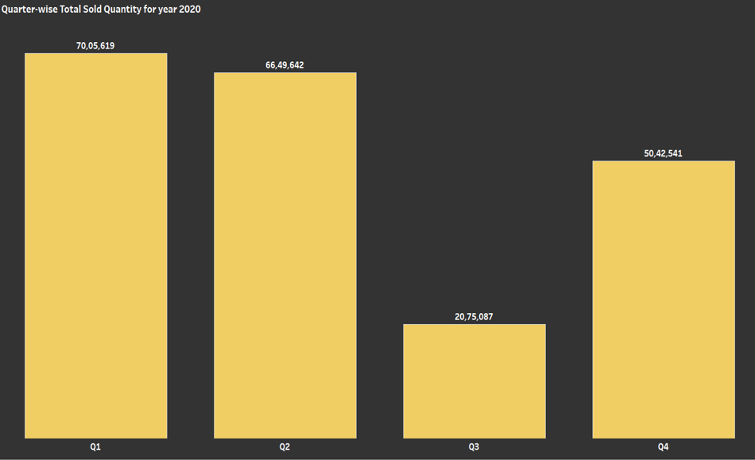

## Question 9.

**Which channel helped to bring more gross sales in the fiscal year 2021 and the percentage of contribution? The final output contains these fields:
a) channel 
b) gross_sales_mln 
c) percentage**
```
with channels_gross as 
(
select c.channel as channel, 
       round(sum(g.gross_price*s.sold_quantity)/1000000, 2) as gross_sales_mln
from dim_customer c inner join fact_sales_monthly s inner join fact_gross_price g
where c.customer_code = s.customer_code
and s.product_code = g.product_code
and s.fiscal_year = g.fiscal_year
and s.fiscal_year = 2021
group by channel)

select channel, gross_sales_mln, round((gross_sales_mln/(select sum(gross_sales_mln) from channels_gross)*100),2) as Percentage
from channels_gross
order by gross_sales_mln desc;
```
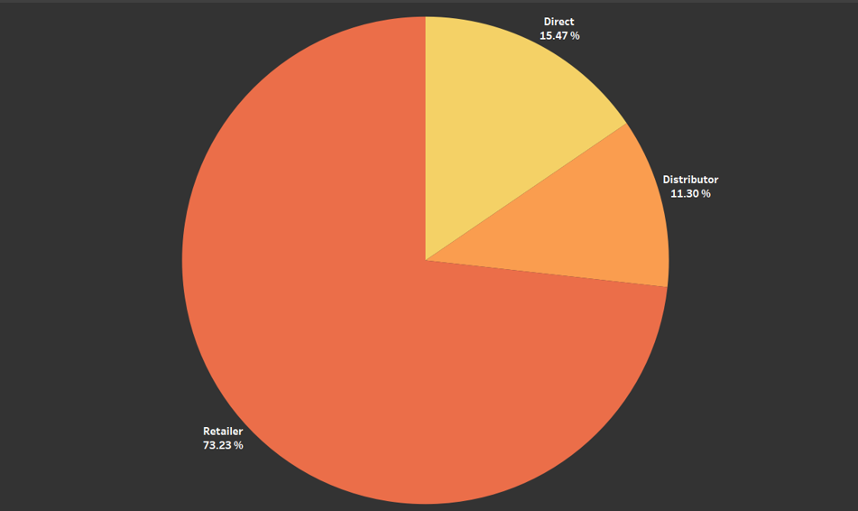


## Question 10.

**Get the Top 3 products in each division that have a high total_sold_quantity in the fiscal_year 2021? The final output contains these fields:
a) division 
b) product_code 
c) product 
d) total_sold_quantity 
e) rank_order**
```
with cte1 as (

select p.division as division, 
       p.product  as product, 
       s.product_code as product_code, 
       sum(s.sold_quantity) as total_sold_quantity
from fact_sales_monthly s inner join dim_product p
where s.product_code = p.product_code
and s.fiscal_year = 2021
group by p.division, p.product),


cte2 as (
select division, product_code, product, category, total_sold_quantity,
       rank() over(partition by division order by total_sold_quantity desc) as rank_order
from cte1)

select * from cte2
where rank_order <= 3;

-- Sales by Market
select c.market as market,
       month(s.date) as month,
       year(s.date) as year,
       round(sum(p.gross_price*s.sold_quantity)/1000000,2) as gross_sales_amount
from fact_gross_price p
inner join fact_sales_monthly s
inner join dim_customer c
where p.product_code = s.product_code 
and s.customer_code = c.customer_code
and c.market = 'India'
group by c.market, year(s.date), month(s.date) 
order by c.market, year(s.date), month(s.date) 
;

-- Sold Quantity by Market
select c.market as market,
       month(s.date) as month,
       year(s.date) as date,
       sum(s.sold_quantity) as sold_quantity,
       s.fiscal_year as fiscal_year
from fact_sales_monthly s
inner join dim_customer c
where s.customer_code = c.customer_code
and c.market = 'India'
group by c.market, year(s.date), month(s.date)
;

-- Sold Quantity by Segment
select p.segment as Segment,
       month(s.date) as month,
       year(s.date) as year,
       sum(s.sold_quantity) as sold_quantity,
       s.fiscal_year as fiscal_year
from fact_sales_monthly s
inner join dim_product p
where s.product_code = p.product_code
and p.segment = 'Accessories'
group by p.segment, year(s.date), month(s.date)
;

-- Manufacturing cost by segment
select p.segment,
	   month(s.date) as month,
       year(s.date) as date,
       round(sum(m.manufacturing_cost*s.sold_quantity)/1000000,2) as manufacturing_cost
from fact_manufacturing_cost m
inner join fact_sales_monthly s
inner join dim_product p  
where m.product_code = p.product_code
and s.product_code = p.product_code
and m.cost_year = s.fiscal_year
and p.segment = 'Notebook'
group by p.segment, year(s.date), month(s.date);

-- Manufacturing cost by year

select month(s.date) as month,
       year(s.date) as year,
       round(sum(m.manufacturing_cost*s.sold_quantity)/1000000,2) as manufacturing_cost
from fact_manufacturing_cost m 
inner join fact_sales_monthly s
inner join dim_product p 
where m.product_code = p.product_code 
and s.product_code = p.product_code 
and m.cost_year = s.fiscal_year
group by year(s.date), month(s.date) 
order by year(s.date), month(s.date) 
;

-- Year wise gross amount and sold quantity
select month(s.date) as month,
       year(s.date) as year,
       sum(s.sold_quantity) as sold_quantity,
       round(sum(p.gross_price*s.sold_quantity)/1000000,2) as gross_sales_amount
from fact_gross_price p
inner join fact_sales_monthly s
inner join dim_customer c
where p.product_code = s.product_code 
and s.customer_code = c.customer_code
group by year(s.date), month(s.date) 
order by year(s.date), month(s.date) 
;
```
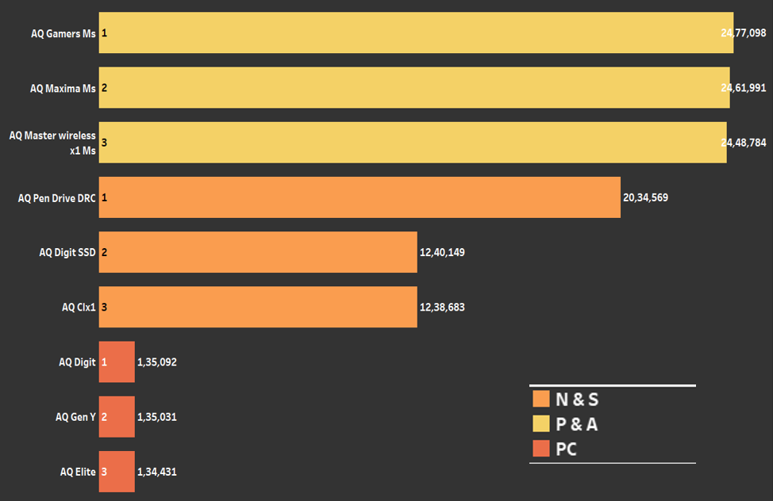


### AUTHOR
<hr>
<strong>Girish.E</strong>


You can get in touch with me on my LinkedIn Profile:<br>
 <a href = "https://www.linkedin.com/in/girish02/"></a>

You can also follow my GitHub Profile to stay updated about my latest projects:<br>
<a href = "https://github.com/GIRISH-E-2002"></a>


If you liked the repo then kindly support it by giving it a star ⭐.